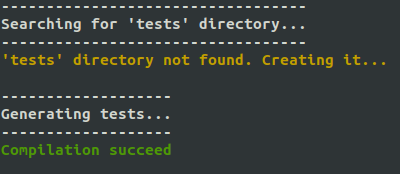

#	Libft-eval

This repository contains many tests for the `libft` project at 42.

##	Installation

Clone this repository in the returned directory (alongside the `libft.a` file).

```shell
git clone https://github.com/VincentBotte/libft_eval
```

##	How to use it ?

Go into the newly repository.

```shell
cd libft_eval
```

There are two scripts that can help you during the defense.

###	`generate.sh`

This script is meant to compile all the tests files. You can use the `make` command though.

To use it, just execute it. You may need to use `chmod` first if you do not have a permission to execute it.

```shell
./generate.sh
```

You should get an output similar to this one.



The script first check if the `tests` directory exists, then execute the make command. If the compilation didn't succeeded, the script displays the error. But don't forget to check the norm yourself.

###	`run_tests.sh`

This script execute each tests file. 

```shell
./run_tests.sh
```

If you pass arguments, it will execute the functions you specified.

```shell
./run_tests.sh bzero memmove
```

### Docker

If you want to use it with Docker, go into the returned directory and execute these commands.

```shell
docker build -t libft_eval -f libft_eval/Dockerfile .
docker run -it libft_eval
```

If you pass arguments, it will execute the functions you specified.

```shell
docker run -it libft_eval bzero memmove
```

